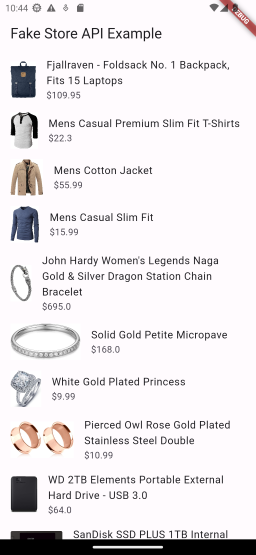

# CUSTOM_FAKE_STORE_API_CO

This repository contains a Flutter package that interacts with the Fake Store API, providing data models, error handling, and examples of how to use it in a Flutter application using clean architecture.

  > This plugin is in Beta. Use it with caution

   

## Features

- Consumption of the Fake Store API.
- Data models to represent store information.
- Error handling using the `dartz` library.
- Example of usage in Flutter with clean architecture.

## Usage

To use the `custom_fake_store_api_co` package in your Flutter application, follow these steps:

1. Import the package in your Dart file:

   ```dart
   import 'package:custom_fake_store_api_co/custom_fake_store_api_co.dart';
   ```

## Installation

Add this line to your `pubspec.yaml` file under the `dependencies` section:

```yaml
dependencies:
  custom_fake_store_api_co:
    git:
      url: https://github.com/tiancris01/CUSTOM_FAKE_STORE_API_CO.git
      ref: main
```

Then run

``` bash
flutter pub get
```

To initialize the `custom_fake_store_api_co` package, create an instance of the `FakeStoreApiClient` class:

```dart
final apiClient = FakeStoreApiClient();
```

You can then use the `apiClient` object to make API calls and retrieve data from the Fake Store API. For example, to get a list of products, you can use the `getProducts` method:

```dart
final products = await apiClient.getProducts();
```

You can also handle errors using the `Either` type from the `dartz` library. For instance, if an error occurs while fetching the products, you can handle it like this:

```dart
final result = await apiClient.getProducts();

result.fold(
  (error) {
    // Handle the error
  },
  (products) {
    // Use the list of products
  },
);
```

Make sure to check the documentation of the `custom_fake_store_api_co` package for more details on how to use it in your Flutter application.

## Contributing

We welcome contributions to the `custom_fake_store_api_co` package! If you have any ideas, bug reports, or feature requests, please open an issue on the GitHub repository.

If you would like to contribute code, you can follow these steps:

1. Fork the repository on GitHub.
2. Clone your forked repository to your local machine.
3. Create a new branch for your changes.
4. Make your changes and commit them.
5. Push your changes to your forked repository.
6. Open a pull request on the original repository.

Please make sure to follow the code style and conventions used in the project. Also, don't forget to write tests for your changes and ensure that all existing tests pass.

We appreciate your contributions and look forward to your pull requests!
## License

The `custom_fake_store_api_co` package is released under the MIT License. See the [LICENSE](https://github.com/tiancris01/CUSTOM_FAKE_STORE_API_CO/blob/main/LICENSE) file for more details.

## Support

If you have any questions or need support, feel free to reach out to us on the [GitHub repository](https://github.com/tiancris01/CUSTOM_FAKE_STORE_API_CO). We'll be happy to assist you!

## Credits

This package was developed by [Your Name](https://github.com/yourusername).
